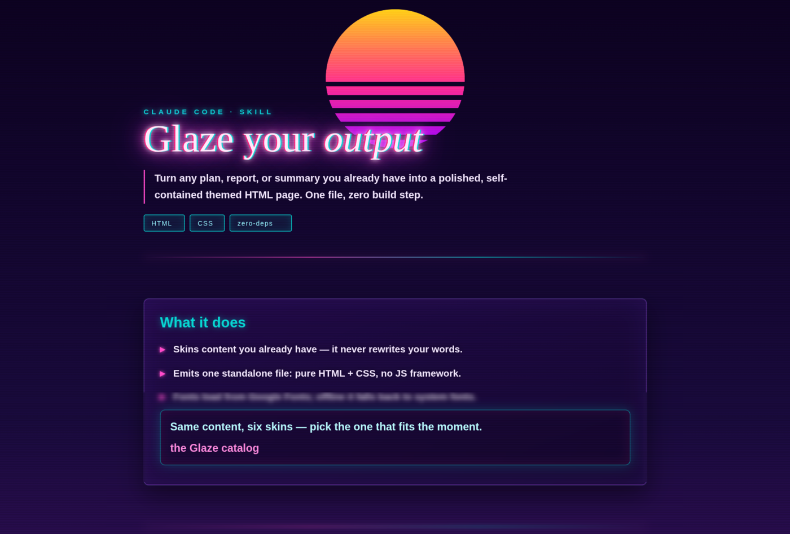
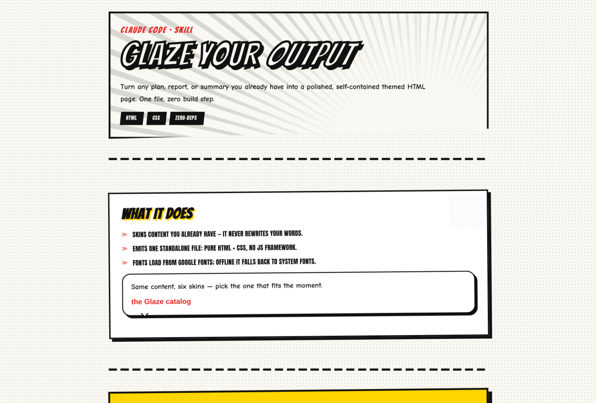
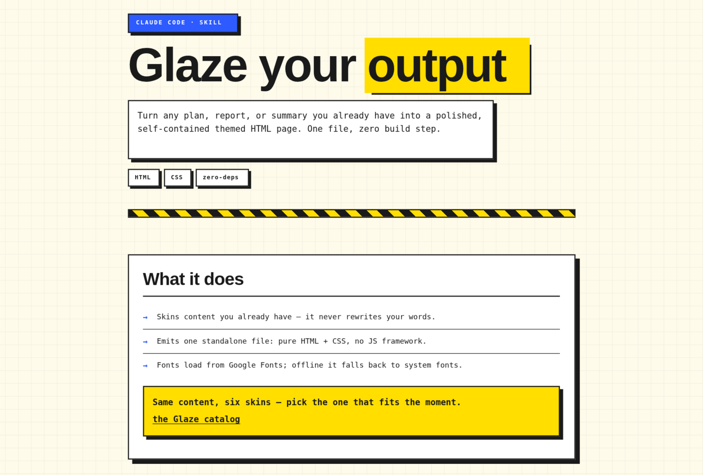
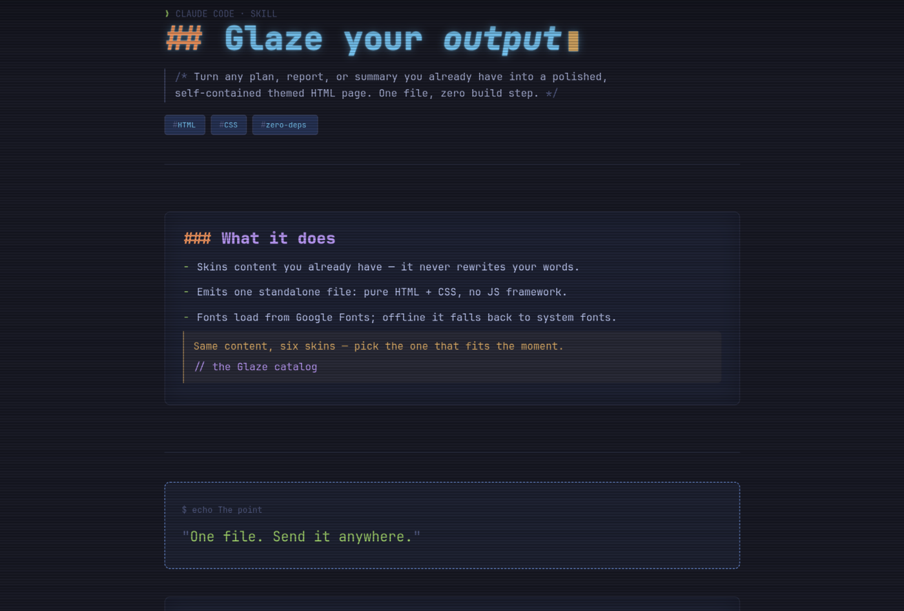
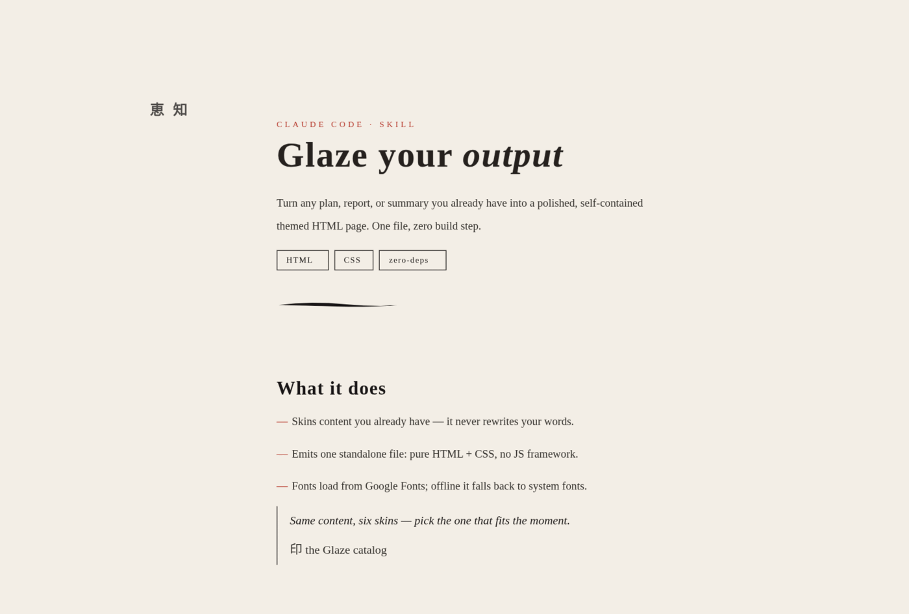
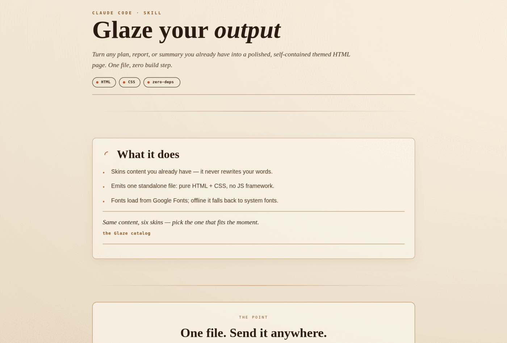
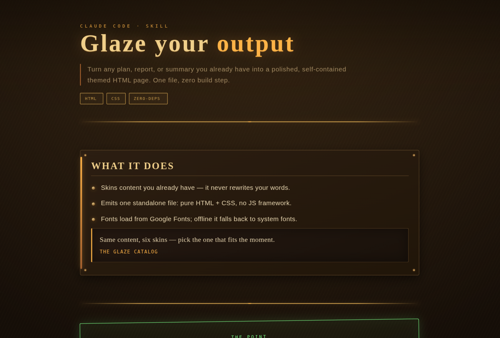
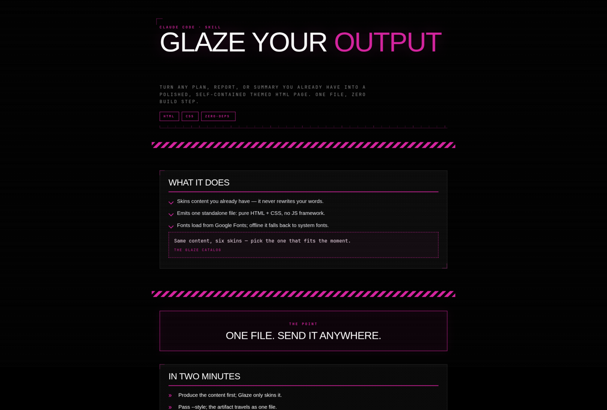

# Glaze

<p align="center">
  <a href="https://github.com/edbizarro/glaze/actions/workflows/ci.yml"></a>
  <a href="LICENSE"></a>
  <a href="https://claude.com/claude-code"></a>
  
  
</p>

**Turn any text output — a plan, a report, a summary, release notes — into a
beautiful, self-contained themed HTML page in one step.**

You already have the content. Glaze *skins* it: it maps your text onto a fixed
structure, applies one of eight award-grade visual themes, and hands back a single
standalone HTML file you can send, open, or publish anywhere. No build step, no JS
framework, nothing to install at render time. Glaze is a
[Claude Code](https://claude.com/claude-code) skill — it restyles content, it never
generates or rewrites it.

[Themes](#the-eight-themes) · [What it is](#what-it-is-and-isnt) ·
[Install](#install) · [Usage](#usage) · [For coding agents](#for-coding-agents) ·
[Add a theme](#add-your-own-theme) · [Develop](#development)

## The eight themes

Same content, eight skins. Each theme is one self-contained CSS file — no build
step, no JS framework.

|  |  |
|:---:|:---:|
| <br>**`synthwave`** — neon outrun 80s | <br>**`manga`** — comic / anime page |
| <br>**`brutalist`** — hard offset shadows | <br>**`terminal`** — CRT / TUI Tokyo Night |
| <br>**`sumi`** — sumi-e / wabi-sabi | <br>**`coffee`** — specialty roaster label |
| <br>**`dieselpunk`** — interwar brass & oiled steel | <br>**`neonops`** — dark ops-HUD / Wipeout |

Or open [`skills/Glaze/Catalog.html`](skills/Glaze/Catalog.html) in a browser to
see them rendered live, side by side.

## What it is (and isn't)

- **It restyles, it never rewrites.** Glaze maps your content onto a fixed
  structure and applies a theme. Your wording — especially verbatim quotes — is
  preserved exactly.
- **It does not invent content.** If the text still has to be produced (a summary,
  an extraction), produce it first, then glaze the result.
- **The output is one standalone file.** Pure HTML and CSS, no build step, no JS
  framework. Fonts load from Google Fonts; with no network the page falls back to
  system fonts and still renders. The file travels — send it, open it anywhere.

## Theme reference

| Theme | Vibe | Signature move | Best for |
|-------|------|----------------|----------|
| `synthwave` | neon outrun 80s | receding 3D grid + chromatic aberration + scanlines | launches, retros, high-energy |
| `manga` | comic/anime page | diagonal ink panels + halftone + SFX | recaps, threads, fun |
| `brutalist` | neo-brutalist | hard offset shadows + clashing blocks + marquee | raw, honest, serious extractions |
| `terminal` | CRT/TUI Tokyo Night | CRT screen layer + vim statusbar + diff lines | technical content (safe default) |
| `sumi` | sumi-e / wabi-sabi | 間 ma + ensō + tate-gaki + hanko seal | calm, reflective, sophisticated |
| `coffee` | specialty roaster label | tasting-notes headline + roast meter + kraft grain | personal, blog, editorial |
| `dieselpunk` | interwar brass & oiled steel | riveted brass plates + engraved title + amber power-bar + gauges + phosphor stamp | bold industrial, ops, retro-futurist |
| `neonops` | dark ops-HUD (Designers-Republic / Wipeout) | corner-bracketed cells + dot-matrix + marching hazard stripe + scanlines + magenta signal + blinking sys cursor | dashboards, ops, status reports, data |

## Install

In Claude Code:

```
/plugin marketplace add edbizarro/glaze
/plugin install glaze@glaze
```

That's it. Glaze is now available in your sessions. (Working without the plugin
system? See [For coding agents](#for-coding-agents) for the manual install.)

## Usage

Ask Claude to glaze content, naming a theme:

```
glaze this summary --style synthwave
```

Or describe it in plain language — "make this report pretty in the coffee theme",
"render the plan as a terminal-themed page". If you don't name a theme, Claude
asks which of the eight you want.

```
glaze <content-or-reference> --style <synthwave|manga|brutalist|terminal|sumi|coffee|dieselpunk|neonops>
```

- `<content>` can be pasted text, a file path, or the previous message.
- `--style random` picks one at random.
- Aliases: `vaporwave`→synthwave, `anime`→manga, `neo`→brutalist, `crt`/`tui`→terminal,
  `wabi`→sumi, `cafe`→coffee, `diesel`/`steampunk`/`brass`→dieselpunk,
  `neon`/`ops`/`dataops`/`hud`/`wipeout`→neonops.

## For coding agents

This section is written for AI coding agents (Claude Code, Cursor, Codex, and the
like) operating Glaze without a human in the loop. It is the contract; the full
spec lives in [`skills/Glaze/SKILL.md`](skills/Glaze/SKILL.md) and
[`skills/Glaze/Workflows/Render.md`](skills/Glaze/Workflows/Render.md).

### Install (manual — no plugin system required)

Glaze is a self-contained skill directory. Clone the repo and link the skill into
the agent's skills path so it loads automatically:

```bash
git clone https://github.com/edbizarro/glaze.git
# Claude Code — personal (all sessions) or project-scoped:
ln -s "$PWD/glaze/skills/Glaze" ~/.claude/skills/Glaze
#   …or:  ln -s "$PWD/glaze/skills/Glaze" <project>/.claude/skills/Glaze
```

A symlink keeps the skill in sync with `git pull`; `cp -r` works too if you want a
frozen copy. Everything the skill needs ships in `skills/Glaze/` — themes,
`template.html`, and the workflows. No dependencies are installed to *render*; the
`package.json` at the repo root exists only for linting (see
[Development](#development)).

### How to work with the skill

Read `SKILL.md` first — it is the source of truth. The non-negotiable contract:

1. **Skin, don't generate.** Glaze never writes the content. If the body must be
   produced (a summary, an extraction), produce it in a prior step, then glaze it.
2. **Always resolve a theme.** Pass `--style <theme>`. If none is given, *ask* —
   never silently pick. `terminal` is the safe default for technical content.
3. **Emit exactly one self-contained file.** Inline `Themes/_base.css` then the
   chosen `Themes/<theme>.css` into `template.html`'s `{{GLAZE_STYLE}}` placeholder
   (base first, theme second so the theme wins). Never link CSS by relative path —
   the artifact must travel.
4. **Stay on the content model.** Use only the canonical classes
   (`.glaze`, `.glaze-head`, `.block`, `.points`, `.quote`, …). No inline styles.
   Preserve verbatim quotes character-for-character.
5. **Verify before "done".** Open the file in a browser (headless is fine), confirm
   the theme's signature elements and fonts rendered and the prose is legible, then
   screenshot. Continuous animations stall screenshot tools — freeze them first with
   `*,*::before,*::after{animation:none !important}`.

Render pipeline in brief (full version in `Workflows/Render.md`):

```
resolve content + theme  →  map content onto template.html's classes
  →  inline _base.css + <theme>.css into {{GLAZE_STYLE}}
  →  write reports/glaze-<slug>-<theme>-YYYY-MM-DD.html
  →  open in a browser and verify  →  deliver the file
```

> Prefer a dedicated agent file? These instructions drop cleanly into an
> [`AGENTS.md`](https://agents.md) at the repo root, the emerging open standard that
> agents read automatically.

## Add your own theme

A theme is one self-contained CSS file. Drop a `Themes/<name>.css` that styles the
content-model classes, register it in `SKILL.md`, and add a tile to `Catalog.html`.
The `AddTheme` workflow walks through it. See
[`skills/Glaze/Workflows/AddTheme.md`](skills/Glaze/Workflows/AddTheme.md).

## Customize defaults

Glaze ships generic. If your setup has a per-skill preferences file, Glaze honors
it for your preferred language, default theme, output directory, footer
classification, and signature — without touching the shipped skill.

## Development

The skill itself ships zero-dependency (pure HTML + CSS). The tooling in
`package.json` is for linting only:

```
bun install
bun run lint      # stylelint (themes) + html-validate (template + catalog)
```

CI ([`.github/workflows/`](.github/workflows)) runs `claude plugin validate`,
JSON-Schema validation of both manifests, and the lint suite on every PR.

## License

[MIT](LICENSE) © Eduardo Bizarro
