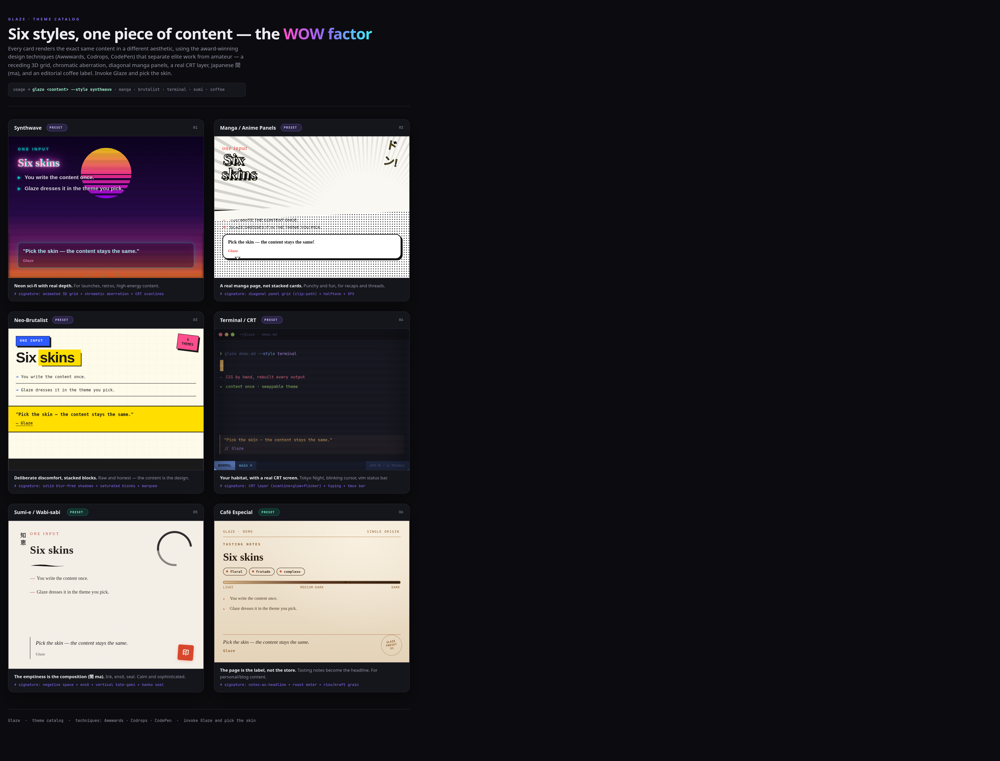

# Glaze

**Turn any text output — a plan, a report, a summary, release notes — into a
beautiful, self-contained themed HTML page.**

Glaze is a [Claude Code](https://claude.com/claude-code) skill. It takes content
you already have and renders it as a polished, standalone HTML file in a visual
theme of your choice. Glaze *skins* content — it does not generate it.



## What it is (and isn't)

- **It restyles, it never rewrites.** Glaze maps your content onto a fixed
  structure and applies a theme. Your wording — especially verbatim quotes — is
  preserved exactly.
- **It does not invent content.** If the text still has to be produced (a summary,
  an extraction), produce it first, then glaze the result.
- **The output is one standalone file.** Pure HTML and CSS, no build step, no JS
  framework. Fonts load from Google Fonts; with no network the page falls back to
  system fonts and still renders. The file travels — send it, open it anywhere.

## Themes

| Theme | Vibe | Signature move | Best for |
|-------|------|----------------|----------|
| `synthwave` | neon outrun 80s | receding 3D grid + chromatic aberration + scanlines | launches, retros, high-energy |
| `manga` | comic/anime page | diagonal ink panels + halftone + SFX | recaps, threads, fun |
| `brutalist` | neo-brutalist | hard offset shadows + clashing blocks + marquee | raw, honest, serious extractions |
| `terminal` | CRT/TUI Tokyo Night | CRT screen layer + vim statusbar + diff lines | technical content (safe default) |
| `sumi` | sumi-e / wabi-sabi | 間 ma + ensō + tate-gaki + hanko seal | calm, reflective, sophisticated |
| `coffee` | specialty roaster label | tasting-notes headline + roast meter + kraft grain | personal, blog, editorial |

Open [`skills/Glaze/Catalog.html`](skills/Glaze/Catalog.html) in a browser to see
all six rendered side by side.

## Install

In Claude Code:

```
/plugin marketplace add edbizarro/glaze
/plugin install glaze@glaze
```

That's it. Glaze is now available in your sessions.

## Usage

Ask Claude to glaze content, naming a theme:

```
glaze this summary --style synthwave
```

Or describe it in plain language — "make this report pretty in the coffee theme",
"render the plan as a terminal-themed page". If you don't name a theme, Claude
asks which of the six you want.

```
glaze <content-or-reference> --style <synthwave|manga|brutalist|terminal|sumi|coffee>
```

- `<content>` can be pasted text, a file path, or the previous message.
- `--style random` picks one at random.
- Aliases: `vaporwave`→synthwave, `anime`→manga, `neo`→brutalist, `crt`/`tui`→terminal,
  `wabi`→sumi, `cafe`→coffee.

## Add your own theme

A theme is one self-contained CSS file. Drop a `Themes/<name>.css` that styles the
content-model classes, register it in `SKILL.md`, and add a tile to `Catalog.html`.
The `AddTheme` workflow walks through it. See
[`skills/Glaze/Workflows/AddTheme.md`](skills/Glaze/Workflows/AddTheme.md).

## Customize defaults

Glaze ships generic. If your setup has a per-skill preferences file, Glaze honors
it for your preferred language, default theme, output directory, footer
classification, and signature — without touching the shipped skill.

## License

[MIT](LICENSE) © Eduardo Bizarro
